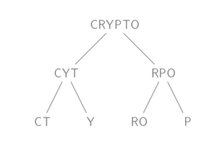

## Cesar Pista @₹62
**Chall**

The plaintext is in English and case sensitive. Submit the entire text wrapping it in cryptX{}. The punctuations and spaces are the same as those in the plaintext.
```
Xlmw irgvCtxih qiwweki wlepp gpevmjC lsA RSX xs irgvCtx e qiwweki xsheC! Izir mj mx Aew wyjjmgmirx efsyx 6444 Cievw eks, sv xs fi qsvi tvigmwi mr xli Ciev 88 FG, rsAeheCw mx mw rsx. XsheC iegl ws-geppih Wgvmtx Omhhmi Asyph fi efpi xs kix wirwmxmzi mrjsvqexmsr, mj xliC Aivi irgvCtxih xlmw AeC.
```

**Solution**

Here the trick was 62 = 26 (Lower Case)+ 26 (Upper Case) + 10 (Decimal digits)
This whole set must be considered as the character space.
For eg – If y is shifted by 3 it changes to B instead of b
Doing so on shifting by 4 we get
```
This encrypted message shall clarify how NOT to encrypt a message today! Even if it was sufficient about 2000 years ago, or to be more precise in the Year 44 BC, nowadays it is not. Today each so-called Script Kiddie would be able to get sensitive information if they were encrypted this way.
```
**Flag**
```
cryptX{This encrypted message shall clarify how NOT to encrypt a message today! Even if it was sufficient about 2000 years ago, or to be more precise in the Year 44 BC, nowadays it is not. Today each so-called Script Kiddie would be able to get sensitive information if they were encrypted this way.}
```

## BroCODE
**Chall**

Encryption Scheme:

Step1: All spaces in the plaintext are removed.

Step2: The plaintext is split into 2 parts. The left part consists of all letters that are in  even positions (0-based indexing). Rest letters on the right part.

Step3: Step2 is repeated on the resultant strings until the length of each part is less than or equal to 2 letters.

Step4: All the parts are merged to form the ciphertext.

See example.jpg for an illustrative example of encryption of plaintext```CRYPTO```.



The ciphertext given below is encrypted using the above scheme
```mNsnhHnrh411DD3940```

**Solution**

**Flag**
```
cryptX{m4H3nDr4s1n9hDh0N1}
```

## Rookie SA challenge
**Chall**
```
e: 1
c: 8663069917557759315104008369297528808616317
n: 245841236512478852752909734912575581815967630033049838269083
```
Submit the flag by wrapping it within cryptX{}

**Solution**

By the capitalization of letters in the heading, we can observe that it is hinting towards RSA.
In the flag.txt file we are given
```
e: 1
c: 37207601978871992194562586639512228182470162740294525
n: 245841236512478852752909734912575581815967630033049838269083 
c = (p^e)mod(n)
```
Here since e is 1, p = c + n*i where i is any integer from 0.
For i = 0 we get the flag.

**Flag**
```
cryptX{4J1NKY4_R5H4N3}
```

## Vadapav obviously!
**Chall**

Decode:

cryptX{**w**hat **w**o**uld** you **cho**o**s**e if **I** ga**ve** **y**ou **a** cho**ice** in a ba**c**on a**n**d **a** **v**adapav?}


**Solution**

The letters in bold are of a typeface eg - **b** where as the standard are the other typeface eg - **a**.  
From the above consideration we get **baaa babbb aaa bbbaba aa b aabb baa b aaabbb aa a aabaa aba b baaaaaaa**.  
On decoding the above bacon cipher we get **rohitsharma**.  

For more information - [Bacon Cipher](https://en.wikipedia.org/wiki/Bacon%27s_cipher#Baconian_cipher_example)

**Flag**
```
cryptX{rohitsharma}
```

## Redundant Key
**Chall**

Just submit what you got 
```python
import string
 
cipher = bytes.fromhex("02101a11163b1a373c5530503e3a5333532d261f")
 
def byte_xor(ba1, ba2):
    return bytes([_a ^ _b for _a, _b in zip(ba1, ba2)])

for i in string.printable:
    print(i, byte_xor(cipher, bytes(i, 'utf8')))
```

**Solution**

Here we can see that the cipher text is being XOR’ed with some characters.
Since we know the first 7 characters of the flag which is **cryptX{** we can XOR this with the cipher text to get the first 7 characters of the key.
On doing so we get output to be **abcabca** which by the title of the challenge is repeating with the basic unit abc.
Hence XORing it with a string of abc where it is repeated multiple times gives us the flag.

**Flag**
```
cryptX{U_4R3_X0R1NG}
```

## July Us College
**Chall**
```python
import string

LOWERCASE_OFFSET = ord("a")
ALPHABET = string.ascii_lowercase[:16]

def b16_encode(plain):
	enc = ""
	for c in plain:
		binary = "{0:08b}".format(ord(c))
		enc += ALPHABET[int(binary[:4], 2)]
		enc += ALPHABET[int(binary[4:], 2)]
	return enc

def shift(c, k):
	t1 = ord(c) - LOWERCASE_OFFSET
	t2 = ord(k) - LOWERCASE_OFFSET
	return ALPHABET[(t1 + t2) % len(ALPHABET)]

flag = "redacted"
key = "redacted"
assert all([k in ALPHABET for k in key])
assert len(key) == 1

b16 = b16_encode(flag)
enc = ""
for i, c in enumerate(b16):
	enc += shift(c, key[i % len(key)])
print(enc)
```
ciphertext:
```
epabdfecaodbepabedaodb
```
Submit your answer by wrapping it with cryptX{}

**Solution**

**Flag**
```
cryptX{r4hu1dr4v1d}
```
